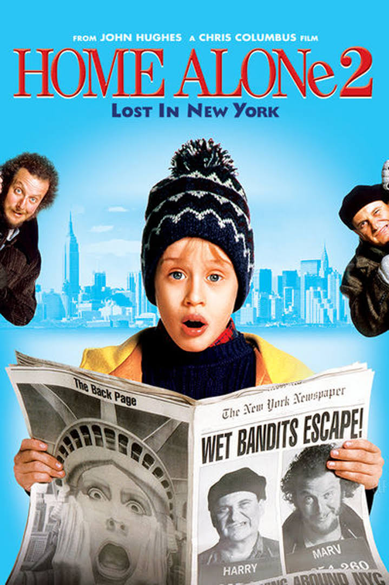

<!-- 영화 제목
이미지
줄거리
정보(감독, 배우 등)
본인의 평점
예고편 youtube 링크
뒤로가기(홈) 링크 -->

# **나홀로집에2 - 뉴욕을 헤매다**

---

###### 캐빈은 가족과 함께 플로리다로 크리스마스 휴가를 떠나기로 한다. 그러나 공항의 소란속에서 그만 뉴욕행 비행기에 오르게 되어 거대한 도시에 혼자 남게된다. 홀로 뉴욕에서 해방감을 느끼는 캐빈은 아버지의 카드로 플로리다 호텔에 투숙하는 한편 덩컨 장난감가게에서 만난 덩컨씨가 크리스마스때 번 돈을 어린이병원에 기부하려는 계획을 알게된다. 그러나 이때 캐빈은 감옥에서 탈출한 마브와 해리를 덩컨가게 앞에서 만나 쫓기다가 해리와 마브에게 잡히고 만다. 여기에서 해리와 마브가 이 기부금을 노린다는 사실을 알게된 케빈은 간신히 도망쳐 삼촌의 집을 이용해 이 두 도둑을 저지시킬 준비에 들어간다. 결국 캐빈에게 혼이난 두 멍청한 도둑들은 공원에서 캐빈의 신고로 출동한 경찰에 잡히고, 캐빈은 카드를 추적해 찾아온 엄마와 극적인 상봉을 한다.

---

## __영화 정보__
#### _개봉일_ 1992.12.18.
#### _감독_ 크리스 콜롬버스
#### _등급_ 전체 관람가
#### _국가_ 미국
#### _러닝타임_ 115분
#### _장르_ 전체 관람가

## __본인의 평점__
#### _★★★★★ (4.7/5)_

---

[예고편](https://www.youtube.com/watch?v=6ofUnU-Yb5o) 
[홈으로 돌아가기](movie.md)