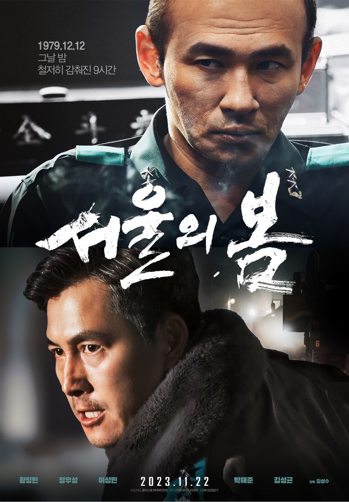

# 서울의 봄  

  

# 줄거리  
1979년 12월 12일, 수도 서울 군사반란 발생  
그날, 대한민국의 운명이 바뀌었다  

대한민국을 뒤흔든 10월 26일 이후,  
서울에 새로운 바람이 불어온 것도 잠시  
12월 12일, 보안사령관 전두광이 반란을 일으키고  
군 내 사조직을 총동원하여 최전선의 전방부대까지 서울로   불러들인다.  
 
권력에 눈이 먼 전두광의 반란군과  
이에 맞선 수도경비사령관 이태신을 비롯한 진압군 사이,  
일촉즉발의 9시간이 흘러가는데…  
  
목숨을 건 두 세력의 팽팽한 대립  
오늘 밤, 대한민국 수도에서 가장 치열한 전쟁이 펼쳐진다  

# 감독
김성수
# 배우
황정민 ,  정우성 ,  이성민 ,  박해준 ,  김성균

# 평점
4.78

[예고편](https://www.youtube.com/watch?v=-AZ7cnwn2YI)  
[홈으로](movie.md)